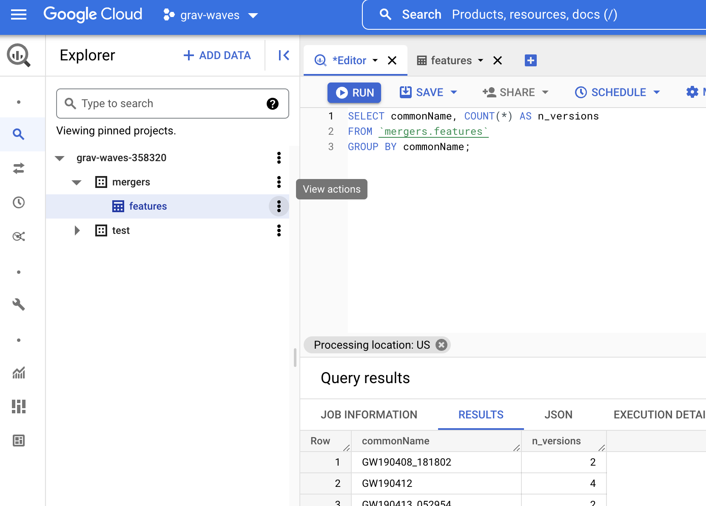
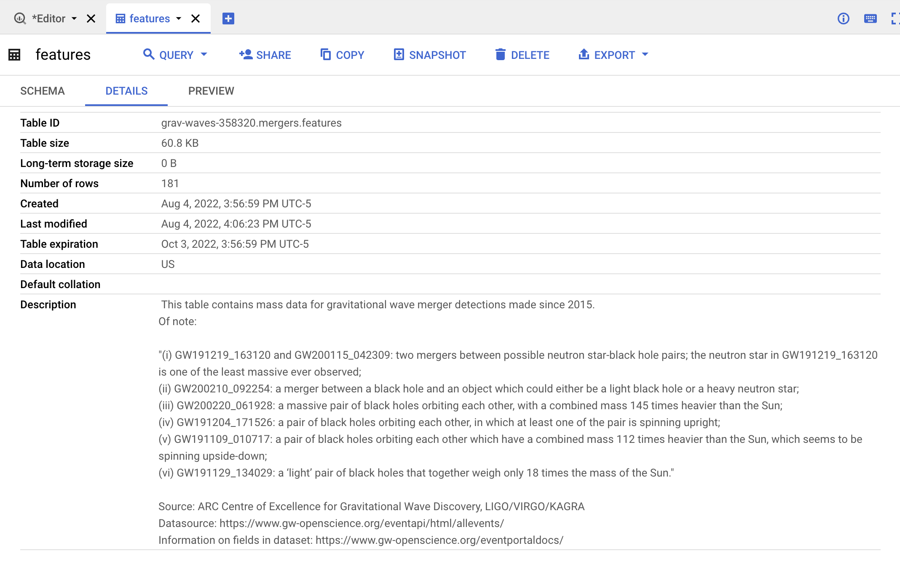
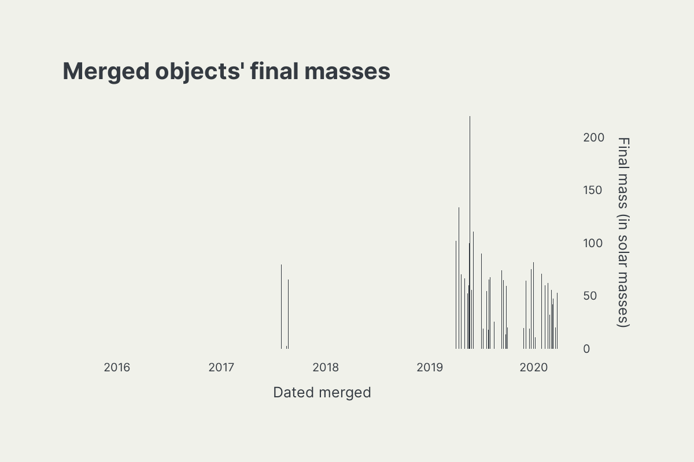
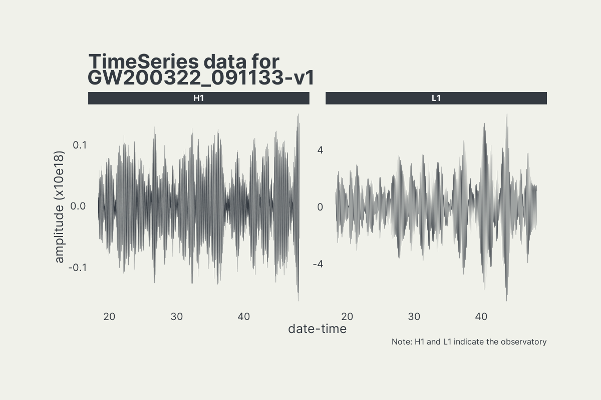

# Background

This repo contains code that can be run from Google Colab to analyze gravitational wave merger detections made since 2015. The data come from the [Gravitational Wave Open Science Center (GWOSC)](https://www.gw-openscience.org/).

## What is a gravitational wave?

Essentially, gravitational waves are "ripples in the space-time pond", the existence of which Albert Einstein first theorized. A great introductory article on these waves, written for the layperson, is [here](https://spaceplace.nasa.gov/gravitational-waves/en/). The VIRGO/LIGO collaboration has also created a [helpful visual](https://www.youtube.com/watch?v=zLAmF0H-FTM):

# Files

The scrits in this repo are prefixed with numbers that indicate the order in which they should be run.

## 00: stand up a Google BigQuery database

This notebook stands up a BigQuery database and fills it with GWOSC data, including raw time series data as well as derived features, such as the masses of the pre-merger objects and final merged object.

This notebook also adds metadata to the database, including descriptions of the schemas and tables.

Why stand up a database on Google Cloud rather than simply using the `gwosc`/`gwpy` packages or API calls? There are a few motivations for this:

1. Storing the data in a relational format makes it easier to join event features to the respective time series data.

2. The time series data is stored **with** the date-time *to microsecond precision* of the amplitude data. Since the dates are human-readable, this makes it easier to work with the time aspect of the strain data. 

3. SQL is an industry-standard querying language, which means that professionals across domains know and use SQL to pull data, and having a SQL database available makes exploration quick and convenient for those across a diverse set of backgrounds. Using `gwpy`, however, requires learning niche functions that are only applicable for pulling this particular set of gravitational wave data.

4. Using SQL is generally more concise than calling APIs (even when applying complex logic) and since it's stored and pulled in the same format needed for exploration and modeling, it doesn't require any restructuring after pulling.

## 01: exploration and visualization

This notebook explores some descriptive statistics of the dataset:

It also visualizes the raw strain data (prior to filtering out some of the background noise):

