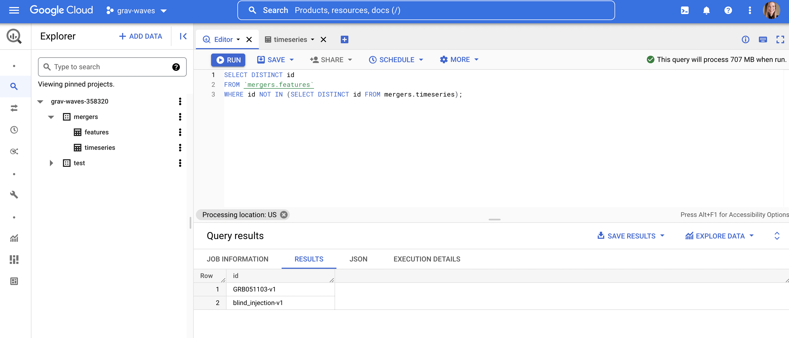

# Background

This repo contains code that can be run from Google Colab to analyze gravitational wave merger detections made since 2015. The data come from the [Gravitational Wave Open Science Center (GWOSC)](https://www.gw-openscience.org/).

## What is a gravitational wave?

Essentially, gravitational waves are "ripples in the space-time pond", the existence of which Albert Einstein first theorized. A great introductory article on these waves, written for the layperson, is [here](https://spaceplace.nasa.gov/gravitational-waves/en/). The VIRGO/LIGO collaboration has also created a [helpful visual](https://www.youtube.com/watch?v=zLAmF0H-FTM):

# Objectives

## Model objective: deep learning to advance astrophysics
On a practical level, this analysis seeks to architect a deep-learning timeseries model (LSTM) that outperforms the baseline model(s) on the selected evaluation metrics. The format of the analysis is inspired by [US Naval Research Laboratory research on solar flare duration forecasting](https://github.com/USNavalResearchLaboratory/flare_duration_forecasting).

## Translational motivation: simplify to innovate
There is also a translational motivation to this analysis. Much of academic research seeks to create cost efficiency by building software or machine learning tools in-house. However, oftentimes industry moves at such a pace that once-expensive solutions become free or low-cost faster than these tools can be built in-house, and the cost can scale with a department's (or consortium of departments') budget (if the budget grows or declines). Thus, this project seeks to also demonstrate that it's currently possible to create an end-to-end analysis from warehousing data to deploying a model endpoint API using industry standards completely free of cost; this is a step towards eliminating the time-cost (months to, more often, years) within academia of developing **and maintaining** custom ML software and virtualization solutions.

# Files

The scripts in this repo are prefixed with numbers that indicate the order in which they should be run.

## 00: stand up a Google BigQuery database

This notebook stands up a BigQuery database and fills it with GWOSC data, including raw time series data as well as derived features, such as the masses of the pre-merger objects and final merged object.

This notebook also adds metadata to the database, including descriptions of the schemas and tables.

Why stand up a database on Google Cloud rather than simply using the `gwosc`/`gwpy` packages or API calls? There are a few motivations for this:

1. Storing the data in a relational format makes it easier to join event features to the respective time series data.

2. The time series data is stored **with** the date-time *to microsecond precision* of the amplitude data. Since the dates are human-readable, this makes it easier to work with the time aspect of the strain data. 

3. SQL is an industry-standard querying language, which means that professionals across domains know and use SQL to pull data, and having a SQL database available makes exploration quick and convenient for those across a diverse set of backgrounds. Using `gwpy`, however, requires learning niche functions that are only applicable for pulling this particular set of gravitational wave data.

4. Using SQL is generally more concise than calling APIs (even when applying complex logic) and since it's stored and pulled in the same format needed for exploration and modeling, it doesn't require any restructuring after pulling.

## 01: exploration and visualization

This notebook explores some descriptive statistics of the dataset:

It also visualizes the raw strain data (prior to filtering out some of the background noise):

## 02: create baseline and deep learning timeseries models

This notebook performs the pre-processing necessary and creates both a baseline model as well as a long-short term memory (LSTM) neural network model and compares the performance of the two in predicting different gravitational wave data.

The LSTM model architecture (at this point) is straightforward:

The preliminary results of some testing of the model are visualized below.

Further work tuning the LSTM hyperparameters is currently underway.

## 03: deployment on Google AI Platform

This notebook deploys the TensorFlow LSTM model to a GCP API endpoint so that prediction and evaluation logging are fully operationalized and can be performed in real-time with little additional effort.

Next steps include migrating to Vertex AI, the new MLOps platform that GCP has released.